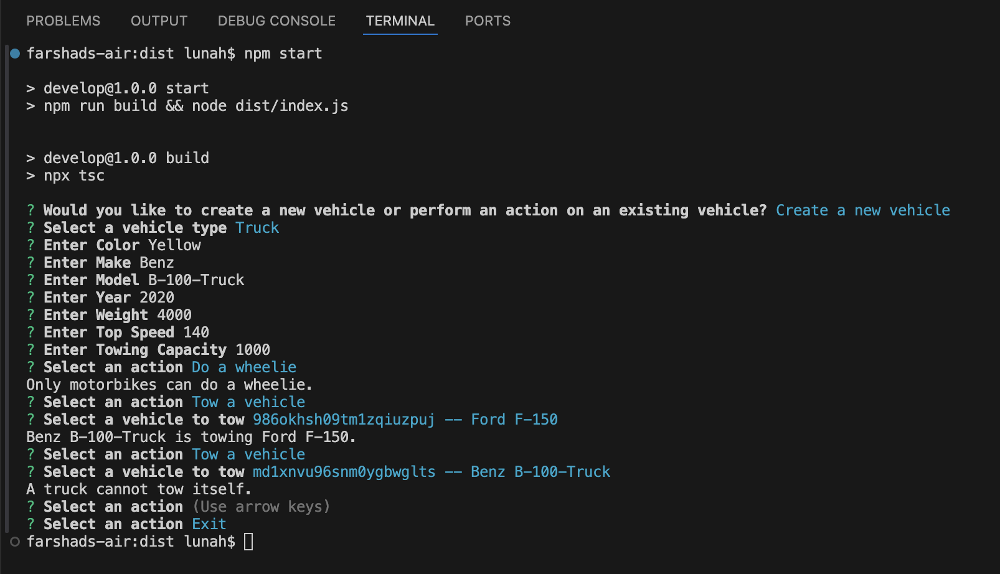
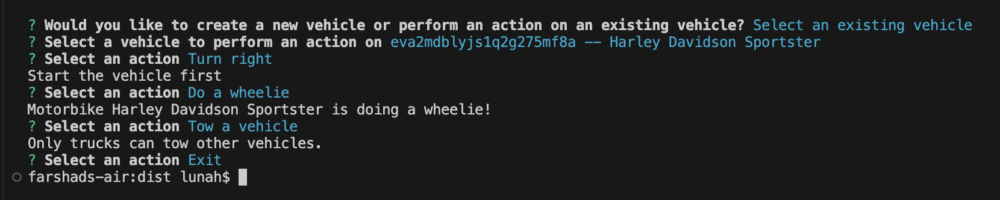

# TypeScript-Command-line-Application

## Description
ThisTypeScript command-line application that builds and uses cars to include additional options for motorbikes and trucks.
in this App the user to either create a new vehicle or select an existing vehicle (uses cars). After going through the creation or selection process, the user is able to perform certain actions with the selected vehicle. The user is returned to the actions menu after each action until they decide to exit the application.

- **Motivation:** I wanted to build an interactive Command-Line Application (CLI) that simulates vehicle management, leveraging TypeScript, OOP principles, and user input handling.
- **Purpose:** This project demonstrates how to create a scalable, well-structured CLI using TypeScript, implementing:

1. Class-based inheritance
2. Interfaces
3. User interactions with Inquirer.js
- **Problem Solved:** 
1. Simulates real-world vehicle management (creating, managing, and performing actions).
2. Introduces structured object-oriented programming (OOP) concepts.
3. Implements error handling, user prompts, and dynamic choices in a CLI.
- **What I Learned:** 
1. How to use TypeScript with OOP concepts like classes, inheritance, and interfaces.
2. How to implement an interactive CLI using Inquirer.js.
3. Handling asynchronous user inputs efficiently in a structured TypeScript application.
4. How to enforce type safety and avoid runtime errors with TypeScript.

## Table of Contents

- [Installation](#installation)
- [Usage](#usage)
- [Credits](#credits)
- [License](#license)
- [Badges](#badges)
- [Features](#features)
- [How to Contribute](#how-to-contribute)
- [Tests](#tests)
- [Video](#video)

## Installation

1. Clone the repository:
   ```sh
   git clone https://github.com/lunahoushmand16/Typescript-Cli-App
   ```
2. Navigate to the project folder:
   ```sh
   cd Typescript-Cli-App
   ```
3. Install dependencies:
   ```sh
   npm install
   ```
4. Run the application:
   ```sh
   npm run start
   ```

## Usage

- This Application prompts the user to either create a new vehicle or select an existing vehicle. 
- After going through the creation or selection process, the user is able to perform certain actions with the selected vehicle. 
- The user is returned to the actions menu after each action until they decide to exit the application.

### Example And Sample Output:

```
? Would you like to create a new vehicle or perform an action on an existing vehicle? Create a new vehicle
? Select a vehicle type Truck
? Enter Color Yellow
? Enter Make Benz
? Enter Model B-100-Truck
? Enter Year 2020
? Enter Weight 4000
? Enter Top Speed 140
? Enter Towing Capacity 1000
? Select an action Do a wheelie
Only motorbikes can do a wheelie.
? Select an action Tow a vehicle
? Select a vehicle to tow 986okhsh09tm1zqiuzpuj -- Ford F-150
Benz B-100-Truck is towing Ford F-150.
? Select an action Tow a vehicle
? Select a vehicle to tow md1xnvu96snm0ygbwglts -- Benz B-100-Truck
A truck cannot tow itself.
? Select an action (Use arrow keys)
? Select an action Exit
```

### Screenshots:




## Credits

- Created by **[Luna Houshmans](https://github.com/lunahoushmand16)**
- Built with [Node.js](https://nodejs.org/) and [Inquirer](https://www.npmjs.com/package/inquirer)
- Link for info [TypeScript](https://www.typescriptlang.org/docs/handbook/2/functions.html)
- Info about how to choose your license [Licenses](https://choosealicense.com/licenses/)

## License

This project is licensed under the **MIT License**. See the [LICENSE](LICENSE) file for details.

## Badges


## Features

- 🚗 Create & Manage Vehicles: Supports Car, Truck, and Motorbike
- 🎛 Interactive CLI: Uses Inquirer.js for user-friendly interactions
- 🚚 Towing Functionality: Trucks can tow other vehicles (if within capacity)
- 🏍 Motorbike Special Action: Perform a wheelie action
- 🛠 Vehicle Operations: Start, stop, accelerate, decelerate, turn, and reverse
- 🔍 TypeScript & OOP: Implements classes, interfaces, and strong typing
- 📂 Modular Code Structure: Clean separation of concerns for better maintainability

## How to Contribute

1. Fork the repository
2. Create a new branch: `git checkout -b feature-name`
3. Make changes and commit: `git commit -m 'Added new feature'`
4. Push changes: `git push origin feature-name`
5. Open a pull request

## Tests

Install dependencies and Run the application with node index.js or Use npm run start to run the CLI app in one step
And start to play around with creating a new Vehicle as Truck or Car or Motorbike or choose exsisting Vehicle for other actions.

## Video

[Watch the demo](https://app.screencastify.com/v3/watch/rWX7SYr4ahaT4v7zjs27)
